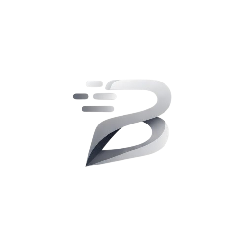

# BLITE

**Privacy-first encrypted messaging.** Text, voice, and video — all end-to-end encrypted.



---

## Screenshots

<!-- TODO: add screenshots here -->
> Screenshots coming soon. Try the [live demo](https://blite.chat) or self-host to see it in action.

---

## Features

- **E2EE Messaging** — Double Ratchet for DMs, Sender Keys for channels (same protocols as Signal)
- **E2EE Voice & Video** — AES-GCM encrypted, SFU-based via mediasoup
- **Communities** — Servers with channels, roles, permissions, and invites
- **Friends & DMs** — 1-on-1 messaging, voice calls, and video calls
- **File Sharing** — Send files and images in chats
- **Desktop App** — Windows and Linux (Electron), web app also available
- **Self-hostable** — One script setup, Docker-based, SQLite, no external dependencies

---

## Try It

**Hosted:** [blite.chat](https://blite.chat)

**Desktop downloads:** [Releases](https://github.com/blitechat/BLITE/releases)

---

## Self-Hosting

3 commands to get running:

```bash
git clone https://github.com/blitechat/BLITE && cd BLITE
bash setup.sh
# Choose "lite" (text only) or "full" (voice + video)
```

Full self-hosting documentation: [SELF_HOST.md](SELF_HOST.md)

Requirements: Linux, Docker, Docker Compose, 512 MB RAM minimum.

---

## Security & Privacy

- Server **cannot read** message content — everything is encrypted client-side
- Server **cannot decrypt** voice or video streams
- Metadata (timing, membership) is visible to the server operator — self-hosting eliminates that trust requirement
- See [PRIVACY.md](PRIVACY.md) for full details

---

## License

[MIT](LICENSE)
